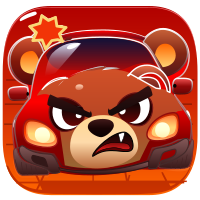

<p align="center">
  
</p>

<h1 align="center">Gridlock</h1>

<p align="center">
  A sliding puzzle game where you navigate cars out of a gridlocked parking lot.<br>
  Inspired by the classic <a href="https://en.wikipedia.org/wiki/Rush_Hour_(puzzle)">Rush Hour</a> board game.
</p>

<p align="center">
  Built with <a href="https://love2d.org">Love2D</a> — runs on macOS, Windows, Web, and mobile.
</p>

## Gameplay

Move cars by dragging them along their axis. Horizontal cars slide left/right, vertical cars slide up/down. Clear a path for the **red car** to reach the exit on the right side of the board.

**Rules:**
- Cars can only move along their orientation (horizontal or vertical)
- Cars cannot pass through each other
- Move the red goal car to the exit to clear the level

## Play

### Web

Play directly in your browser (no install required):

> **[Play Gridlock](https://sejoung.github.io/gridlock/)**

### Desktop

Download the latest release from [Releases](https://github.com/sejoung/gridlock/releases):

| Platform | File | How to run |
|----------|------|------------|
| macOS | `gridlock-macos.zip` | Extract and open `Gridlock.app` |
| Windows | `gridlock-windows.zip` | Extract and run `gridlock.exe` |
| Universal | `gridlock.love` | Requires [Love2D](https://love2d.org) installed |

### From Source

```bash
# Install Love2D
# Download from https://love2d.org

# Clone and run
git clone https://github.com/sejoung/gridlock.git
cd gridlock
love .
```

## Controls

| Input | Action |
|-------|--------|
| Mouse drag / Touch | Move a car |
| `H` | Hint (progressive: highlight → direction → auto-move) |
| `U` | Undo last move |
| `R` | Reset level |
| `Esc` | Quit |

## Features

- 17 levels with pixel art car sprites
- Progressive hint system (BFS solver powered)
- Undo / Reset with move counter
- Smooth move animations and shake feedback on invalid moves
- Pulsing exit indicator
- Procedural sound effects
- Save system (tracks cleared levels and best move counts)
- Level select screen with clear status
- Auto-update: new levels downloaded from server on launch
- Responsive display: scales to any screen size with virtual resolution

## Hint System

Press `H` or click the Hint button for progressive help:

| Press | Action |
|-------|--------|
| 1st | Highlights which car to move (green glow) |
| 2nd | Shows the direction to move (arrow) |
| 3rd | Automatically performs the move |

Hints are calculated using a BFS solver from the current board state. Using hints is marked on the clear screen.

## Level Generator

A browser-based tool for creating and analyzing levels:

```bash
open tools/generator.html
```

- **Generate** levels by difficulty (Easy / Medium / Hard / Mixed)
- **Analyze** existing `.lua` level files — BFS solver finds minimum moves and detects overlaps
- Visual board preview and `.lua` file export

Difficulty is determined by the minimum number of moves to solve (BFS):

| Difficulty | Min Moves |
|------------|-----------|
| Easy | 1 - 8 |
| Medium | 9 - 16 |
| Hard | 17+ |

## Auto-Update

The game checks for new levels on launch via GitHub Pages:

1. Fetches `levels-version.txt` (lightweight version check)
2. If version differs, downloads `levels.json` with new level data
3. Caches locally — works offline after first download

New levels are added by pushing `.lua` files to the `levels/` folder. CI automatically generates and deploys the update.

## Project Structure

```
gridlock/
├── main.lua              # Entry point
├── conf.lua              # Love2D config (resizable window)
├── src/
│   ├── game.lua          # Game state management
│   ├── board.lua         # Grid, collision, clear detection
│   ├── car.lua           # Car rendering with sprites
│   ├── car_types.lua     # Car type definitions (len, sprite)
│   ├── input.lua         # Mouse/touch drag input
│   ├── level.lua         # Level loader + auto-update
│   ├── hint.lua          # BFS solver + progressive hints
│   ├── save.lua          # Save/load cleared data
│   ├── ui.lua            # UI screens (title, level select, HUD, clear)
│   ├── anim.lua          # Move/shake animations
│   ├── sound.lua         # Procedural sound effects
│   ├── screen.lua        # Virtual resolution scaling
│   └── json.lua          # Lightweight JSON parser
├── assets/
│   ├── cars/             # Pixel art car sprites
│   ├── tiles/            # Tileset for board rendering
│   ├── ui/               # UI assets (window icon)
│   └── icon/             # App icons (svg, png, ico, icns, android)
├── levels/
│   ├── level1.lua        # Level data files
│   └── ...
└── tools/
    ├── generator.html    # Web-based level generator/analyzer
    ├── generate-icons.sh # Generate all icon formats from SVG
    └── build-levels-json.sh  # Convert levels to JSON for auto-update
```

## Level Format

Levels are plain Lua tables. Add new levels by creating `levels/levelN.lua`:

```lua
return {
    id = 1,
    exit = { side = "right", row = 3 },
    cars = {
        { id = "goal", x = 1, y = 3, dir = "H", type = "sport_red" },
        { id = "c1",   x = 3, y = 1, dir = "V", type = "trailer" },
        { id = "c2",   x = 5, y = 2, dir = "V", type = "sedan_blue" },
    }
}
```

Available car types are defined in `src/car_types.lua`. Length is determined by the type (`trailer` = 3 cells, everything else = 2 cells).

## Building

### Continuous Build (every push to main)

Automatically builds all platforms and deploys web version to GitHub Pages.

### Release (tag-based)

```bash
git tag v1.0.0
git push origin --tags
```

Creates a GitHub Release with:
- `.love` file (universal)
- macOS app bundle (`.app`) with custom icon
- Windows executable (`.exe`) with custom icon
- Web build (deployed to GitHub Pages)

### Icons

Generate all icon formats from `assets/icon/icon.svg`:

```bash
./tools/generate-icons.sh
```

Produces `icon.png`, `icon.ico`, `icon.icns`, and Android mipmap icons.

## Tech Stack

- **Engine:** [Love2D](https://love2d.org) 11.4
- **Language:** Lua
- **Art:** 2D top-down pixel art
- **Level Tool:** HTML/JS with BFS solver
- **CI/CD:** GitHub Actions (build on push + release on tag)
- **Hosting:** GitHub Pages (web build + level auto-update)

## License

[Apache License 2.0](LICENSE)
